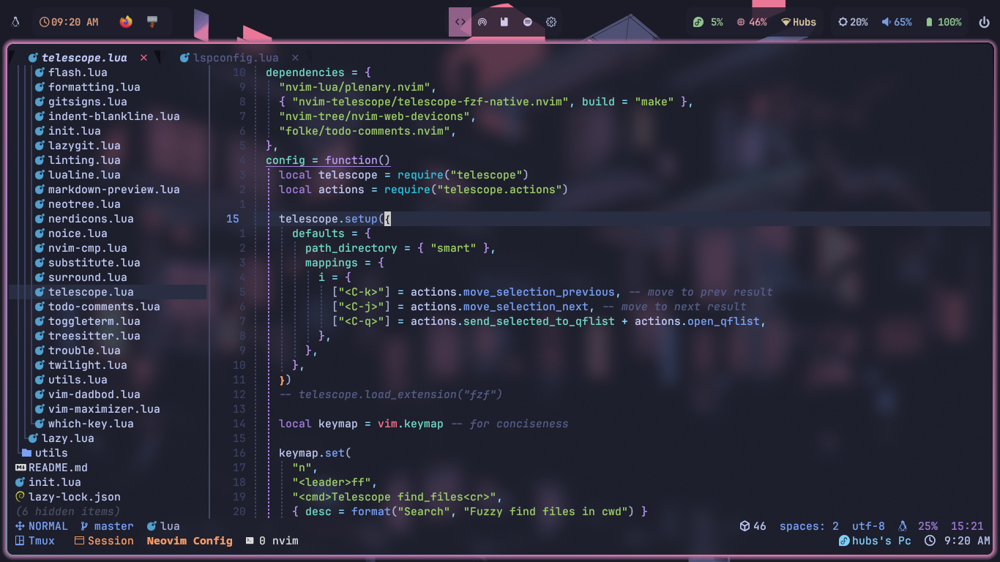

# Nvim

My simple neovim configuration file



## Files structure

```shell
.
├── assets
└── lua
    ├── hubs
    │   ├── core
    │   └── plugins
    │       └── lsp
    └── utils
```

> [!Note]
> Don't forget to run `:checkhealth` command in neovim console after cloning this repo and opening neovim for the first time
